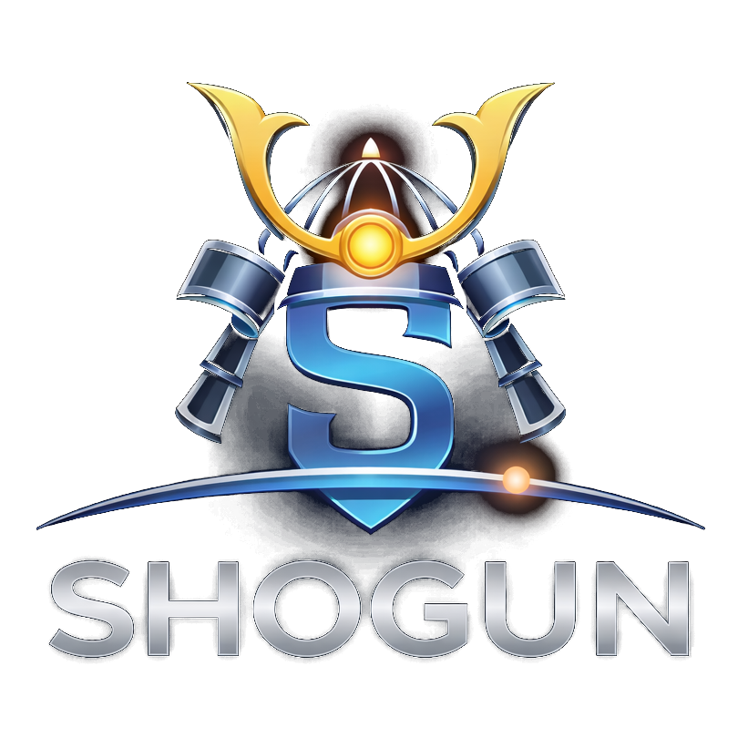
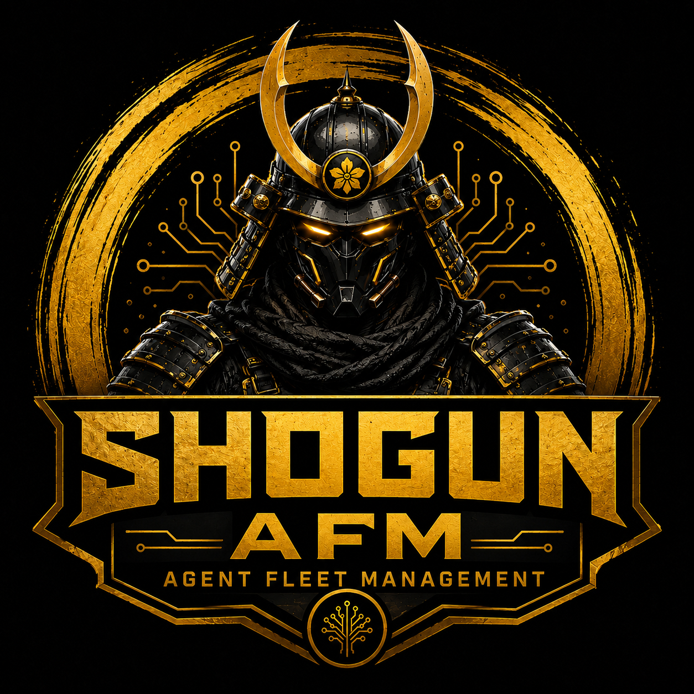

<p align="center">
  
</p>

<h1 align="center">🏯 Shogun AFM — Your AI Command Center</h1>

<p align="center">
  <strong>Shogun is an AI agent control plane with persistent memory, multi-agent orchestration, and full governance. Build, manage, and evolve agents via GUI—no terminal required. Powered by Qdrant, skill systems, and secure, inspectable autonomy.</strong>
</p>

<p align="center">
  <a href="https://github.com/AlphaHorizon-AI/Shogun/releases/latest"></a>
  <a href="#-14-supported-languages"></a>
  <a href="#-install-shogun-one-click"></a>
  <a href="https://www.youtube.com/@ShogunAIAgents"></a>
</p>

---

## 📺 Complete Video Guide

New to Shogun? **Watch the full walkthrough series** on our YouTube channel — from installation to advanced workflows:

### **[▶️ youtube.com/@ShogunAIAgents](https://www.youtube.com/@ShogunAIAgents)**

---

## ⚡ Why Shogun?

Most AI tools give you a chat box. Shogun gives you an **entire operating system for AI agents**.

| | What You Get |
|---|---|
| 🧠 **Multi-Model Intelligence** | Connect OpenAI, Anthropic, Google, Perplexity, OpenRouter, or run local models via Ollama — all at once. Intelligent routing sends each task to the right brain. |
| 🥷 **Agent Fleet** | Deploy specialized sub-agents (Samurai) for research, coding, analysis, or any domain. The Shogun orchestrates them automatically. |
| 📚 **Persistent Memory** | Your AI remembers everything across sessions. Semantic search, salience scoring, and automatic memory consolidation — powered by embedded Qdrant. |
| 🌐 **Browser Automation (Mado)** | Your AI can browse the web, extract content, and take screenshots — all controlled through a secure Playwright layer. |
| 📧 **Email & Calendar** | Connect your IMAP/SMTP inbox and CalDAV calendar. Your Shogun can read, compose, and send emails — and manage your schedule. |
| 💬 **Telegram Integration** | Talk to your AI from your phone. Full streaming responses with live typing indicators. |
| 🔗 **Agent-to-Agent (Nexus)** | Connect multiple Shogun instances across machines. Shared workspaces, typed messaging, and collaborative whiteboards via the A2A protocol. |
| 🔄 **Visual Workflow Builder** | Design multi-step AI pipelines with a drag-and-drop canvas. Chain agents, approvals, logic gates, and browser actions into executable flows. |
| 📜 **Constitutional Governance** | Write YAML rules your AI can never break. Version-controlled, auditable, with enforcement modes (Block / Warn / Audit). |
| 🛡️ **5-Tier Security** | From SHRINE (zero-trust) to RONIN (unrestricted). Fine-grained control over filesystem, network, shell, and tool access. Emergency kill switch (Harakiri) freezes everything instantly. |
| 📊 **Compliance Dashboard** | NIS2, SOC2, and EU AI Act-ready logging. Tamper-proof HMAC audit chain, trace reconstruction, and compliance exports. |
| 🎓 **4,000+ Skills (Dojo)** | Browse and certify your agents on specialized skills from [OpenClaw College](https://www.openclawcollege.com). Training literature, exams, and achievement tracking. |
| 🔄 **Self-Improvement (Bushido)** | Automated reflection cycles where the AI analyzes its own performance and generates optimization insights. |
| 💾 **Backup & Auto-Updates** | Scheduled backups with configurable retention. One-click updates that preserve all your data and settings. |
| 🌍 **14 Languages** | The entire interface is fully translated. Switch anytime from the dashboard. |
| 🏗️ **Setup Wizard** | 8-step guided onboarding gets you operational in minutes. |

**No cloud account needed. No Docker required. Everything runs locally.**

---

## 🎖️ Gensui — Agent Fleet Management

<p align="center">
  
</p>

<p align="center">
  <strong>Shogun AFM (Agent Fleet Management)</strong><br/>
  A dedicated central command platform for managing, monitoring, and securing fleets of Shogun AI agents across your organization.
</p>

When you move beyond a single Shogun instance, **Gensui** becomes your command-and-control hub. It provides real-time visibility into every agent in your fleet — whether that's 3 machines in a startup or 500+ across a global enterprise.

### What Gensui Does

| Capability | Description |
|---|---|
| 📡 **Real-Time Fleet Dashboard** | Live status of every enrolled Shogun instance — online/offline state, samurai count, active workflows, and version info. |
| 🗺️ **Interactive Network Topology** | Visual SVG map of your entire agent fleet with pan/zoom, hub-and-spoke layout, and nexus peer connection lines. |
| 🔍 **LAN Network Scanner** | One-click scan of your local network to discover Shogun instances. Detects enrolled agents, unenrolled (rogue) agents, and unknown services on port 8000. |
| ⚠️ **Rogue Agent Detection** | Instantly spot unauthorized Shogun instances running on your network — critical for security compliance and preventing shadow AI. |
| 🎟️ **Enrollment Token System** | Generate secure enrollment tokens for new Shogun instances. Approve/reject enrollment requests with optional labels. |
| 🏷️ **Group Management** | Organize agents into logical groups (by team, environment, region). Apply policies and postures at the group level. |
| 🛡️ **Security Posture Control** | Define and enforce security postures across your fleet. Standard, Elevated, and Lockdown modes with granular permission control. |
| 💀 **Remote Harakiri** | Emergency kill switch — instantly freeze any agent (soft freeze, hard stop, network isolate, or full terminate) from the Gensui dashboard. |
| 📋 **Centralized Audit Log** | Tamper-proof HMAC-chained audit trail across all managed agents. NIS2/SOC2/EU AI Act compliant. |
| 🔒 **Admin Authentication** | JWT-based admin portal with role-based access control (Owner, Admin, Viewer). |

### Install Gensui (One Click)

Download **one file** for your platform, double-click it, and you're done:

| Platform | Download | Instructions |
|----------|----------|-------------|
| **🪟 Windows** | [⬇️ **Gensui-Install.bat**](https://github.com/AlphaHorizon-AI/Shogun/releases/latest/download/Gensui-Install.bat) | **Click to download** → Double-click the file |
| **🍎 macOS** | [⬇️ **Gensui-Install.command**](https://github.com/AlphaHorizon-AI/Shogun/releases/latest/download/Gensui-Install.command) | **Click to download** → Double-click the file |

### Deployment Options (Advanced)

Gensui runs independently from Shogun instances and can also be deployed via Docker:

| Deployment | Command | Best For |
|---|---|---|
| **🪟 Windows Desktop** | Double-click `gensui/install.bat` | Personal fleet on a Windows machine |
| **🍎 macOS / Linux Desktop** | `./gensui/install.sh` | Personal fleet on Mac or Linux |
| **🐳 Docker (Server)** | `docker compose up` | Production server, always-on |
| **🐳 Docker + TLS** | `docker compose --profile server up` | Production with Nginx reverse proxy, HTTPS, rate limiting |

<details>
<summary><strong>Quick Start — Local Install</strong></summary>

```bash
# Clone the repo
git clone https://github.com/AlphaHorizon-AI/Shogun.git
cd Shogun/gensui

# Windows
install.bat

# macOS / Linux
chmod +x install.sh && ./install.sh
```

Gensui starts at **http://localhost:8787**. Default credentials: `admin@gensui.local` / `changeme`.

</details>

<details>
<summary><strong>Quick Start — Docker Server</strong></summary>

```bash
cd Shogun/gensui

# Basic (no TLS)
docker compose up -d

# Production with TLS (place certs in ./certs/)
docker compose --profile server up -d
```

Includes Nginx reverse proxy with:
- TLS 1.2/1.3 termination
- Rate limiting (30 req/s API, 5 req/min auth)
- Security headers (HSTS, X-Frame-Options, CSP)
- Health checks

</details>

### How It Works

```
┌─────────────────────────────────────────────────┐
│                    GENSUI                       │
│              Agent Fleet Manager                │
│                                                 │
│   ┌──────────┐  ┌──────────┐  ┌──────────┐    │
│   │ Dashboard │  │ Network  │  │ Enrollment│    │
│   │          │  │ Topology │  │ & Tokens  │    │
│   └──────────┘  └──────────┘  └──────────┘    │
│   ┌──────────┐  ┌──────────┐  ┌──────────┐    │
│   │  Groups  │  │ Security │  │  Harakiri │    │
│   │          │  │ Postures │  │ Kill Switch│    │
│   └──────────┘  └──────────┘  └──────────┘    │
└────────────────────┬────────────────────────────┘
                     │ Heartbeat Protocol
         ┌───────────┼───────────┐
         │           │           │
    ┌────▼────┐ ┌────▼────┐ ┌────▼────┐
    │ Shogun  │ │ Shogun  │ │ Shogun  │
    │ Alpha   │ │ Bravo   │ │ Charlie │
    │ (prod)  │ │ (prod)  │ │ (stage) │
    └────┬────┘ └────┬────┘ └─────────┘
         │           │
         └─── Nexus ─┘
        (peer-to-peer)
```

Each Shogun instance sends periodic heartbeats to Gensui with status, metrics, and version info. Gensui cross-references these against its enrollment database to classify every agent as enrolled, unenrolled, or unknown — providing instant visibility into your fleet's security posture.

---

## 🚀 Install Shogun (One Click)

**Prerequisites:** [Python 3.10+](https://www.python.org/downloads/) and [Node.js v18+](https://nodejs.org/en/download) must be installed.

Download **one file** for your platform, double-click it, and you're done:

| Platform | Download | Instructions |
|----------|----------|-------------|
| **🪟 Windows** | [⬇️ **Shogun-Install.bat**](https://github.com/AlphaHorizon-AI/Shogun/releases/latest/download/Shogun-Install.bat) | **Click to download** → Double-click the file |
| **🍎 macOS** | [⬇️ **Shogun-Install.command**](https://github.com/AlphaHorizon-AI/Shogun/releases/latest/download/Shogun-Install.command) | **Click to download** → Double-click the file |

**The installer automatically:**
- ✅ Downloads Shogun from GitHub (no git needed)
- ✅ Sets up the Python environment and installs all dependencies
- ✅ Builds the interface
- ✅ Creates a **desktop shortcut** (⚔️ Shogun — The Tenshu)
- ✅ Opens the **Setup Wizard** in your browser

### What Happens Next

1. **Your browser opens** to the Setup Wizard
2. Walk through **8 guided steps**: pick your language (14 available), name your AI agent, connect a model provider (OpenAI, Anthropic, Google, etc.), and configure governance rules
3. **Done** — you're taken to The Tenshu, your mission control dashboard
4. **Next time**, just click the ⚔️ **Shogun** shortcut on your Desktop

> 📺 **Need help?** Watch the [complete setup walkthrough on YouTube](https://www.youtube.com/@ShogunAIAgents).

---

## 🖥️ After Installation

### Launching Shogun

| Platform | How to launch |
|----------|--------------| 
| **Windows** | Double-click **"Shogun — The Tenshu"** on your Desktop |
| **macOS** | Double-click **Shogun.app** on your Desktop |
| **Linux** | Double-click **shogun.desktop** on your Desktop |

Shogun opens at **http://localhost:8000** in your default browser. *(If your OS blocks the popup, type that address manually.)*

### 🧹 Uninstalling Shogun

Open your `Shogun` installation folder and run the uninstaller:

| Platform | How to uninstall |
|----------|-----------------| 
| **Windows** | Double-click **`uninstall.bat`** |
| **macOS/Linux** | Run **`./uninstall.sh`** |

*Removes the virtual environment, databases, memories, desktop shortcut, and the folder itself.*

---

## 🏗️ The Shogun Architecture

Shogun is built around a clear hierarchy of interconnected systems:

| Module | What It Does |
|--------|-------------|
| ⚔️ **Shogun** | Your primary AI orchestrator — the central brain that coordinates everything |
| 🥷 **Samurai** | Specialized sub-agents for domain-specific tasks (research, coding, analysis) |
| 🏯 **The Tenshu** | Mission control dashboard — the React UI you interact with |
| 💬 **Comms** | Direct chat with streaming responses, chat history, email client, and calendar |
| ⚔️ **The Katana** | Model providers, API tools, routing profiles, and Telegram integration |
| 📚 **Archives** | Persistent memory with semantic search, salience scoring, and vector embeddings |
| 📜 **Kaizen** | Constitutional governance — versioned YAML rules the AI must follow |
| 🔄 **Bushido** | Self-improvement engine with scheduled reflection cycles and insight generation |
| ⛩️ **The Torii** | 5-tier security gateway with fine-grained permissions and kill switch |
| 🥋 **The Dojo** | Skills system — 4,000+ certifiable capabilities from [OpenClaw College](https://www.openclawcollege.com) |
| 🪟 **Mado** | Browser automation layer — web browsing, screenshots, content extraction via Playwright |
| 🔗 **Nexus** | Agent-to-Agent collaboration — shared workspaces across Shogun instances |
| 🔄 **Agent Flow** | Visual workflow builder — drag-and-drop multi-agent pipelines |
| 🎖️ **Gensui** | Agent Fleet Management — central command for monitoring and securing fleets of Shogun agents |

---

## 🌍 14 Supported Languages

The entire interface — menus, labels, explainers, and system messages — is fully translated:

| | Language | Native Name | Code |
|---|----------|-------------|------|
| 🇬🇧 | English | English | `en` |
| 🇩🇪 | German | Deutsch | `de` |
| 🇮🇹 | Italian | Italiano | `it` |
| 🇫🇷 | French | Français | `fr` |
| 🇪🇸 | Spanish | Español | `es` |
| 🇵🇹 | Portuguese | Português | `pt` |
| 🇵🇱 | Polish | Polski | `pl` |
| 🇩🇰 | Danish | Dansk | `da` |
| 🇳🇴 | Norwegian | Norsk | `no` |
| 🇸🇪 | Swedish | Svenska | `sv` |
| 🇺🇦 | Ukrainian | Українська | `uk` |
| 🇨🇳 | Chinese | 中文 | `zh` |
| 🇯🇵 | Japanese | 日本語 | `ja` |
| 🇰🇷 | Korean | 한국어 | `ko` |

---

## 🧑‍💻 Developer Install (With Git)

<details>
<summary>Click to expand developer instructions</summary>

```bash
git clone https://github.com/AlphaHorizon-AI/Shogun.git
cd Shogun
```

| Platform | Command |
|----------|---------|
| **Windows** | Double-click `install.bat` |
| **macOS/Linux** | `chmod +x install.sh && ./install.sh` |

Or install manually:

```bash
python -m venv venv
source venv/bin/activate        # Linux / Mac
# venv\Scripts\activate         # Windows

pip install -e .
cd frontend && npm install && npm run build && cd ..
python -m shogun
```

**Endpoints:**
- **Tenshu UI**: http://localhost:8000/
- **Setup Wizard**: http://localhost:8000/setup
- **API Docs**: http://localhost:8000/docs
- **Reset Setup**: `POST /api/v1/setup/reset`

No Docker, no external services. SQLite + Qdrant embedded handles everything locally.

</details>

---

## 🔧 Tech Stack

| Component | Technology |
|-----------|------------|
| Backend | Python, FastAPI, SQLAlchemy 2.0 |
| Frontend | React, TypeScript, Vite |
| Database | SQLite (default) / PostgreSQL (optional) |
| Vector Memory | Qdrant (embedded) |
| Browser Automation | Playwright |
| Email | IMAP / SMTP |
| Calendar | CalDAV |
| Validation | Pydantic v2 |
| Scheduling | APScheduler |
| Embeddings | sentence-transformers |
| Fleet Management | Gensui (independent SQLite + React UI) |
| Containerization | Docker, Docker Compose, Nginx |

---

## 📺 Resources

- **[YouTube — Video Guides](https://www.youtube.com/@ShogunAIAgents)** — Full walkthrough series from install to advanced
- **[OpenClaw College](https://www.openclawcollege.com)** — AI skills marketplace
- **[GitHub Releases](https://github.com/AlphaHorizon-AI/Shogun/releases)** — Download the latest version

---

## License

[Proprietary](LICENSE.md) — [AlphaHorizon AI](https://github.com/AlphaHorizon-AI)
