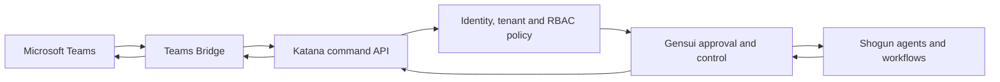

# Microsoft Teams Adapter

The Katana Teams Adapter makes Teams a governed communication surface, not a
control plane. Microsoft activities terminate at the customer-hosted bridge,
become a channel-neutral command envelope, and cross the same authorization
boundary used by Shogun and Gensui.

The bridge uses the Microsoft 365 Agents SDK. Shogun remains fully operational
when Teams or the bridge is unavailable. See the setup, security, manifest, and
troubleshooting guides in this directory.
